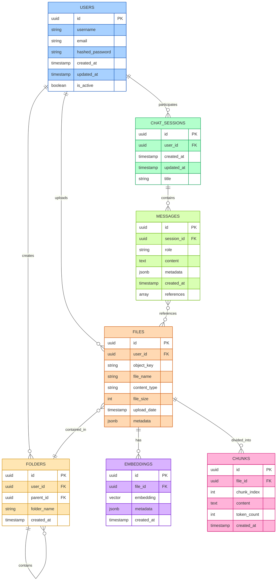

```mermaid
erDiagram
    USERS {
        uuid id PK
        string username
        string email
        string hashed_password
        timestamp created_at
        timestamp updated_at
        boolean is_active
    }
    
    FILES {
        uuid id PK
        uuid user_id FK
        string object_key
        string file_name
        string content_type
        int file_size
        timestamp upload_date
        jsonb metadata
    }
    
    FOLDERS {
        uuid id PK
        uuid user_id FK
        uuid parent_id FK
        string folder_name
        timestamp created_at
    }
    
    EMBEDDINGS {
        uuid id PK
        uuid file_id FK
        vector embedding
        jsonb metadata
        timestamp created_at
    }
    
    CHUNKS {
        uuid id PK
        uuid file_id FK
        int chunk_index
        text content
        int token_count
        timestamp created_at
    }
    
    CHAT_SESSIONS {
        uuid id PK
        uuid user_id FK
        timestamp created_at
        timestamp updated_at
        string title
    }
    
    MESSAGES {
        uuid id PK
        uuid session_id FK
        string role
        text content
        jsonb metadata
        timestamp created_at
        array references
    }
    
    %% Entity relationships with improved colors
    USERS ||--o{ FILES : "uploads" 
    USERS ||--o{ FOLDERS : "creates"
    USERS ||--o{ CHAT_SESSIONS : "participates"
    
    FILES ||--o{ EMBEDDINGS : "has"
    FILES ||--o{ CHUNKS : "divided_into"
    FILES }o--|| FOLDERS : "contained_in"
    
    FOLDERS ||--o{ FOLDERS : "contains"
    
    CHAT_SESSIONS ||--o{ MESSAGES : "contains"
    MESSAGES }o--o{ FILES : "references"
    
    %% Entity attribute styling
    classDef users fill:#a8d1ff,stroke:#0047b3
    classDef files fill:#ffd9b3,stroke:#cc5200
    classDef folders fill:#ffe6b3,stroke:#cc8800
    classDef embeddings fill:#d9b3ff,stroke:#6600cc
    classDef chunks fill:#ffb3d9,stroke:#cc0066
    classDef chat fill:#b3ffcc,stroke:#00994d
    classDef messages fill:#d9ffb3,stroke:#66b300
    
    class USERS users
    class FILES files
    class FOLDERS folders
    class EMBEDDINGS embeddings
    class CHUNKS chunks
    class CHAT_SESSIONS chat
    class MESSAGES messages
``` 