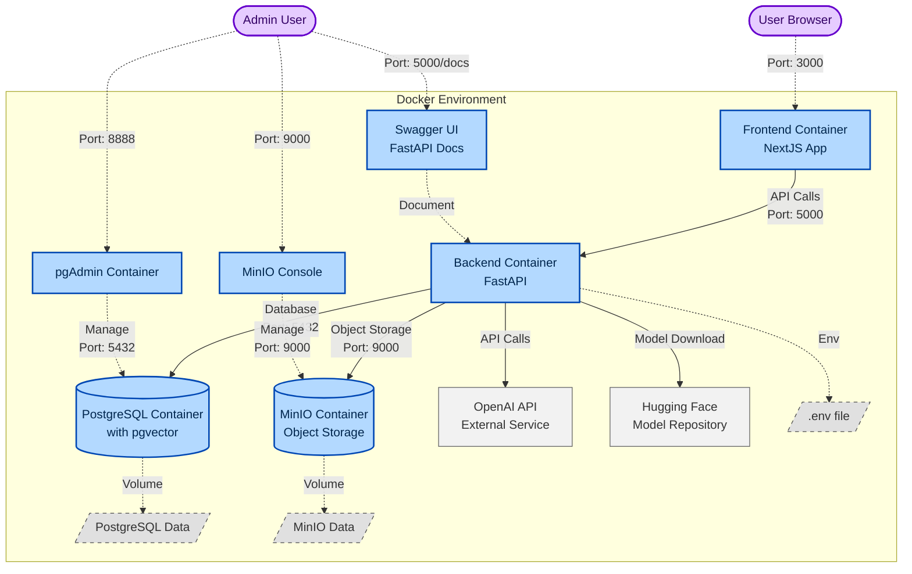

```mermaid
graph TD
    %% External User Access
    User([User Browser]) -.->|Port: 3000| Frontend
    Admin([Admin User]) -.->|Port: 9000| MinIOConsole
    Admin -.->|Port: 5000/docs| SwaggerUI
    Admin -.->|Port: 8888| pgAdmin
    
    %% Container definitions with docker-compose services
    subgraph "Docker Environment"
        %% Frontend container
        Frontend[Frontend Container<br/>NextJS App]
        
        %% Backend container
        Backend[Backend Container<br/>FastAPI]
        
        %% Database containers
        PostgreSQL[(PostgreSQL Container<br/>with pgvector)]
        pgAdmin[pgAdmin Container]
        
        %% Storage containers
        MinIO[(MinIO Container<br/>Object Storage)]
        MinIOConsole[MinIO Console]
        
        %% API Documentation
        SwaggerUI[Swagger UI<br/>FastAPI Docs]
        
        %% External Services (moved inside)
        OpenAI[OpenAI API<br/>External Service]
        HuggingFace[Hugging Face<br/>Model Repository]
        
        %% Internal network connections
        Frontend -->|API Calls<br/>Port: 5000| Backend
        Backend -->|Object Storage<br/>Port: 9000| MinIO
        Backend -->|Database<br/>Port: 5432| PostgreSQL
        
        %% External connections (now inside)
        Backend -->|API Calls| OpenAI
        Backend -->|Model Download| HuggingFace
        
        %% Admin connections
        pgAdmin -.->|Manage<br/>Port: 5432| PostgreSQL
        MinIOConsole -.->|Manage<br/>Port: 9000| MinIO
        SwaggerUI -.->|Document| Backend
        
        %% Volume mounts
        PostgreSQL -.->|Volume| PostgreSQLData[/PostgreSQL Data/]
        MinIO -.->|Volume| MinIOData[/MinIO Data/]
        
        %% Environment variables
        Backend -.->|Env| EnvFile[/.env file/]
    end
    
    %% Styling - Improved color contrast
    classDef container fill:#b3d9ff,stroke:#0047b3,stroke-width:2px,color:#00264d
    classDef volume fill:#e0e0e0,stroke:#4d4d4d,stroke-width:1px,stroke-dasharray:5 5,color:#333333
    classDef external fill:#f2f2f2,stroke:#666666,stroke-width:1px,color:#333333
    classDef user fill:#e6ccff,stroke:#6600cc,stroke-width:2px,color:#330066
    
    class Frontend,Backend,PostgreSQL,pgAdmin,MinIO,MinIOConsole,SwaggerUI container
    class PostgreSQLData,MinIOData,EnvFile volume
    class OpenAI,HuggingFace external
    class User,Admin user
``` 