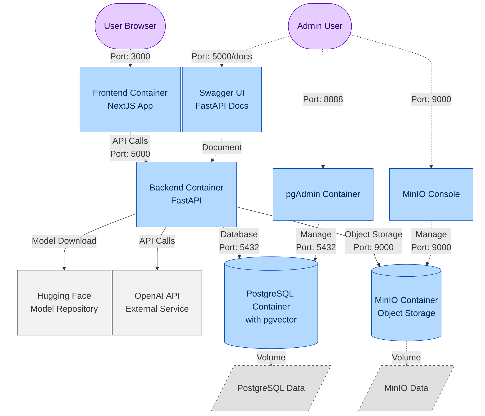

```mermaid
%%{init: {'themeVariables': { 'nodeBorder': '1px', 'fontSize': '20px', 'fontFamily': 'arial'}, 'flowchart': {'nodeSpacing': 4, 'rankSpacing': 6, 'useMaxWidth': false}}}%%
flowchart TD
    %% External User Access
    User([User Browser]) -.->|Port: 3000| Frontend
    Admin([Admin User]) -.->|Port: 9000| MinIOConsole
    Admin -.->|Port: 5000/docs| SwaggerUI
    Admin -.->|Port: 8888| pgAdmin
    
    %% Container definitions with docker-compose services
    subgraph DockerEnv [" "]
        %% API Documentation and Frontend (moved together)
        subgraph FrontendGroup [" "]
            direction LR
            SwaggerUI[Swagger UI<br/>FastAPI Docs]
            Frontend[Frontend Container<br/>NextJS App]
        end
        
        %% Backend container
        Backend[Backend Container<br/>FastAPI]
        
        %% Database containers
        PostgreSQL[(PostgreSQL Container<br/>with pgvector)]
        pgAdmin[pgAdmin Container]
        
        %% Storage containers
        MinIO[(MinIO Container<br/>Object Storage)]
        MinIOConsole[MinIO Console]
        
        %% Group all external services and resources vertically with specific order
        subgraph ExternalResources [" "]
            direction TB
            HuggingFace[Hugging Face<br/>Model Repository]
            OpenAI[OpenAI API<br/>External Service]
        end
        
        %% Internal network connections
        Frontend -->|API Calls<br/>Port: 5000| Backend
        Backend -->|Object Storage<br/>Port: 9000| MinIO
        Backend -->|Database<br/>Port: 5432| PostgreSQL
        
        %% External connections
        Backend -->|API Calls| OpenAI
        Backend -->|Model Download| HuggingFace
        
        %% Admin connections
        pgAdmin -.->|Manage<br/>Port: 5432| PostgreSQL
        MinIOConsole -.->|Manage<br/>Port: 9000| MinIO
        SwaggerUI -.->|Document| Backend
        
        %% Volume mounts
        PostgreSQL -.->|Volume| PostgreSQLData[/PostgreSQL Data/]
        MinIO -.->|Volume| MinIOData[/MinIO Data/]
    end
    
    %% Styling - Improved color contrast with more compact nodes
    classDef container fill:#b3d9ff,stroke:#0047b3,stroke-width:1px,color:#00264d,padding:3px 5px
    classDef volume fill:#e0e0e0,stroke:#4d4d4d,stroke-width:1px,stroke-dasharray:5 5,color:#333333,padding:2px 4px
    classDef external fill:#f2f2f2,stroke:#666666,stroke-width:1px,color:#333333,padding:3px 5px
    classDef user fill:#e6ccff,stroke:#6600cc,stroke-width:1px,color:#330066,padding:2px 4px
    classDef resourceGroup fill:none,stroke:none
    
    class Frontend,Backend,PostgreSQL,pgAdmin,MinIO,MinIOConsole,SwaggerUI container
    class PostgreSQLData,MinIOData volume
    class OpenAI,HuggingFace external
    class User,Admin user
    class ExternalResources,FrontendGroup,DockerEnv resourceGroup
``` 