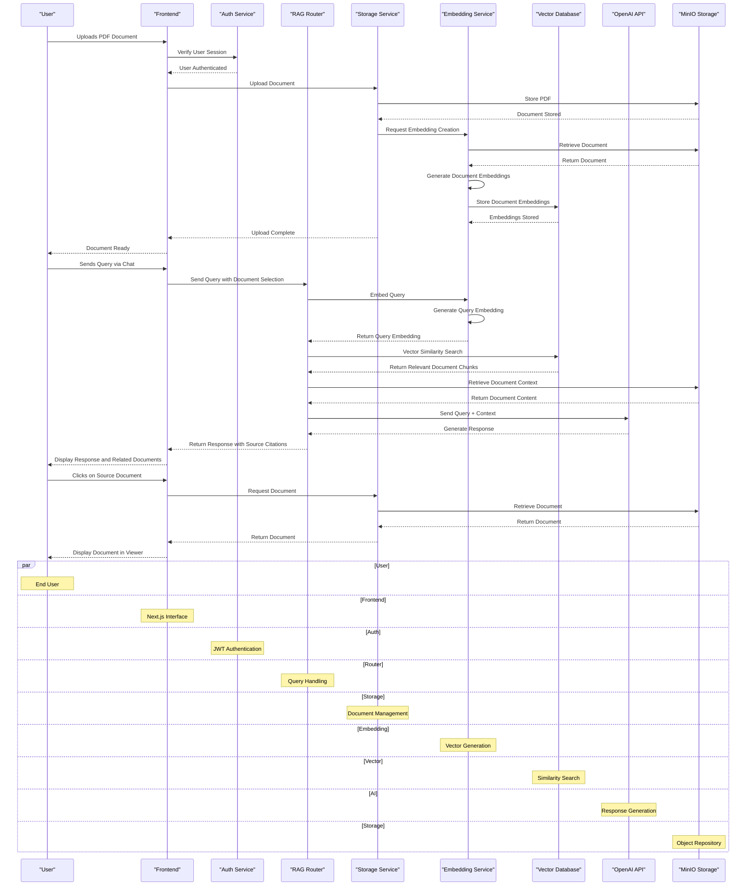

```mermaid
sequenceDiagram
    participant User
    participant Frontend
    participant AuthService
    participant RAGRouter
    participant StorageService
    participant EmbeddingService
    participant VectorDB
    participant OpenAI
    participant MinIO
    
    %% Document Upload Flow
    User->>Frontend: Uploads PDF Document
    Frontend->>AuthService: Verify User Session
    AuthService-->>Frontend: User Authenticated
    Frontend->>StorageService: Upload Document
    StorageService->>MinIO: Store PDF
    MinIO-->>StorageService: Document Stored
    StorageService->>EmbeddingService: Request Embedding Creation
    EmbeddingService->>MinIO: Retrieve Document
    MinIO-->>EmbeddingService: Return Document
    EmbeddingService->>EmbeddingService: Generate Document Embeddings
    EmbeddingService->>VectorDB: Store Document Embeddings
    VectorDB-->>EmbeddingService: Embeddings Stored
    StorageService-->>Frontend: Upload Complete
    Frontend-->>User: Document Ready
    
    %% RAG Chat Flow
    User->>Frontend: Sends Query via Chat
    Frontend->>RAGRouter: Send Query with Document Selection
    RAGRouter->>EmbeddingService: Embed Query
    EmbeddingService->>EmbeddingService: Generate Query Embedding
    EmbeddingService-->>RAGRouter: Return Query Embedding
    RAGRouter->>VectorDB: Vector Similarity Search
    VectorDB-->>RAGRouter: Return Relevant Document Chunks
    RAGRouter->>MinIO: Retrieve Document Context
    MinIO-->>RAGRouter: Return Document Content
    RAGRouter->>OpenAI: Send Query + Context
    OpenAI-->>RAGRouter: Generate Response
    RAGRouter-->>Frontend: Return Response with Source Citations
    Frontend-->>User: Display Response and Related Documents
    
    %% Document Viewing Flow
    User->>Frontend: Clicks on Source Document
    Frontend->>StorageService: Request Document
    StorageService->>MinIO: Retrieve Document
    MinIO-->>StorageService: Return Document
    StorageService-->>Frontend: Return Document
    Frontend-->>User: Display Document in Viewer

    %% Styling with improved color contrast
    par User
        participant User as "User"
        note over User: End User
    and Frontend
        participant Frontend as "Frontend"
        note over Frontend: Next.js Interface
    and Auth
        participant AuthService as "Auth Service"
        note over AuthService: JWT Authentication
    and Router
        participant RAGRouter as "RAG Router"
        note over RAGRouter: Query Handling
    and Storage
        participant StorageService as "Storage Service"
        note over StorageService: Document Management
    and Embedding
        participant EmbeddingService as "Embedding Service"
        note over EmbeddingService: Vector Generation
    and Vector
        participant VectorDB as "Vector Database"
        note over VectorDB: Similarity Search
    and AI
        participant OpenAI as "OpenAI API"
        note over OpenAI: Response Generation
    and Storage
        participant MinIO as "MinIO Storage"
        note over MinIO: Object Repository
    end
``` 