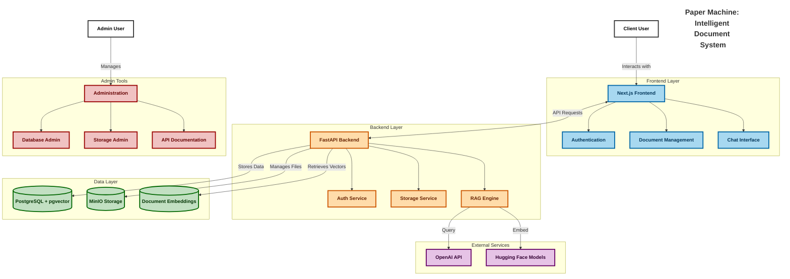

```mermaid
graph TD
    %% Main actors
    User[Client User] -->|Interacts with| Frontend
    AdminUser[Admin User] -->|Manages| AdminTools
    
    %% Core system components
    subgraph "Frontend Layer"
        Frontend[Next.js Frontend]
        Frontend --> AuthUI[Authentication]
        Frontend --> DocumentUI[Document Management]
        Frontend --> ChatUI[Chat Interface]
    end
    
    subgraph "Backend Layer"
        Backend[FastAPI Backend]
        Backend --> AuthService[Auth Service]
        Backend --> StorageService[Storage Service]
        Backend --> RAGEngine[RAG Engine]
    end
    
    subgraph "Data Layer"
        Database[(PostgreSQL + pgvector)]
        ObjectStorage[(MinIO Storage)]
        Embeddings[(Document Embeddings)]
    end
    
    subgraph "External Services"
        LLM[OpenAI API]
        EmbeddingModels[Hugging Face Models]
    end
    
    subgraph "Admin Tools"
        AdminTools[Administration]
        AdminTools --> pgAdmin[Database Admin]
        AdminTools --> MinIOConsole[Storage Admin]
        AdminTools --> SwaggerUI[API Documentation]
    end
    
    %% Key connections
    Frontend <-->|API Requests| Backend
    Backend -->|Stores Data| Database
    Backend -->|Manages Files| ObjectStorage
    Backend -->|Retrieves Vectors| Embeddings
    RAGEngine -->|Query| LLM
    RAGEngine -->|Embed| EmbeddingModels
    
    %% Styling
    classDef frontend fill:#a7d8f0,stroke:#0066a6,stroke-width:3px,color:#003559,font-weight:bold
    classDef backend fill:#ffdcaa,stroke:#cc5500,stroke-width:3px,color:#662200,font-weight:bold
    classDef database fill:#c2e0c2,stroke:#006600,stroke-width:3px,color:#003300,font-weight:bold
    classDef external fill:#e6c3e6,stroke:#660066,stroke-width:3px,color:#330033,font-weight:bold
    classDef admin fill:#f0c2c2,stroke:#990000,stroke-width:3px,color:#660000,font-weight:bold
    classDef user fill:#ffffff,stroke:#333333,stroke-width:3px,color:#000000,font-weight:bold
    
    class Frontend,AuthUI,DocumentUI,ChatUI frontend
    class Backend,AuthService,StorageService,RAGEngine backend
    class Database,ObjectStorage,Embeddings database
    class LLM,EmbeddingModels external
    class AdminTools,pgAdmin,MinIOConsole,SwaggerUI admin
    class User,AdminUser user
    
    %% Title
    title[Paper Machine: Intelligent Document System]
    style title fill:none,stroke:none,color:#333333,font-size:24px,font-weight:bold
``` 