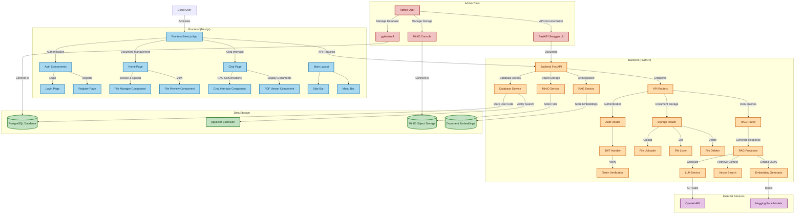

```mermaid
graph TD
    %% User interaction
    User[Client User] -->|Accesses| Frontend[Frontend Next.js App]
    
    %% Frontend components
    subgraph "Frontend (Next.js)"
        Frontend -->|Authentication| AuthComponents[Auth Components]
        AuthComponents -->|Login| LoginPage[Login Page]
        AuthComponents -->|Register| RegisterPage[Register Page]
        
        Frontend -->|Document Management| HomeUI[Home Page]
        HomeUI -->|Browse & Upload| FileManager[File Manager Component]
        HomeUI -->|View| FilePreview[File Preview Component]
        
        Frontend -->|Chat Interface| ChatUI[Chat Page]
        ChatUI -->|RAG Conversations| ChatInterface[Chat Interface Component]
        ChatUI -->|Display Documents| PdfViewer[PDF Viewer Component]
        
        %% Shared components
        MainLayout[Main Layout] --> SideBar[Side Bar]
        MainLayout --> MenuBar[Menu Bar]
    end
    
    %% API Calls
    Frontend -->|API Requests| Backend[Backend FastAPI]
    
    %% Backend components
    subgraph "Backend (FastAPI)"
        Backend -->|Endpoints| Routers[API Routers]
        
        Routers -->|Authentication| AuthRouter[Auth Router]
        Routers -->|Document Storage| StorageRouter[Storage Router]
        Routers -->|RAG Queries| RAGRouter[RAG Router]
        
        %% Core services
        Backend -->|Database Access| DBService[Database Service]
        Backend -->|Object Storage| MinioService[MinIO Service]
        Backend -->|AI Integration| RAGService[RAG Service]
        
        %% Authentication
        AuthRouter --> JWTHandler[JWT Handler]
        JWTHandler -->|Verify| TokenVerifier[Token Verification]
        
        %% Document handling
        StorageRouter -->|Upload| FileUploader[File Uploader]
        StorageRouter -->|List| FileLister[File Lister]
        StorageRouter -->|Delete| FileDeleter[File Deleter]
        
        %% RAG System
        RAGRouter -->|Generate Response| RAGProcessor[RAG Processor]
        RAGProcessor -->|Embed Query| Embedder[Embedding Generator]
        RAGProcessor -->|Retrieve Context| VectorSearch[Vector Search]
        RAGProcessor -->|Generate| LLMService[LLM Service]
    end
    
    %% Data storage
    subgraph "Data Storage"
        %% PostgreSQL with pgvector
        DBService -->|Store User Data| PostgreSQL[(PostgreSQL Database)]
        DBService -->|Vector Search| pgVector[pgvector Extension]
        
        %% MinIO Object Storage
        MinioService -->|Store Files| MinIO[(MinIO Object Storage)]
        
        %% Embeddings
        RAGService -->|Store Embeddings| Embeddings[(Document Embeddings)]
    end
    
    %% External Services
    subgraph "External Services"
        LLMService -->|API Calls| OpenAI[OpenAI API]
        Embedder -->|Model| HuggingFace[Hugging Face Models]
    end
    
    %% Admin Tools
    subgraph "Admin Tools"
        AdminUser[Admin User] -->|Manage Database| pgAdmin[pgAdmin 4]
        AdminUser -->|Manage Storage| MinIOConsole[MinIO Console]
        AdminUser -->|API Documentation| SwaggerUI[FastAPI Swagger UI]
        
        pgAdmin -->|Connect to| PostgreSQL
        MinIOConsole -->|Connect to| MinIO
        SwaggerUI -->|Document| Backend
    end
    
    %% Data Flow - Improved color contrast
    classDef frontend fill:#a7d8f0,stroke:#0066a6,stroke-width:2px,color:#003559
    classDef backend fill:#ffdcaa,stroke:#cc5500,stroke-width:2px,color:#662200
    classDef database fill:#c2e0c2,stroke:#006600,stroke-width:2px,color:#003300
    classDef external fill:#e6c3e6,stroke:#660066,stroke-width:2px,color:#330033
    classDef admin fill:#f0c2c2,stroke:#990000,stroke-width:2px,color:#660000
    
    class Frontend,AuthComponents,LoginPage,RegisterPage,HomeUI,FileManager,FilePreview,ChatUI,ChatInterface,PdfViewer,MainLayout,SideBar,MenuBar frontend
    class Backend,Routers,AuthRouter,StorageRouter,RAGRouter,DBService,MinioService,RAGService,JWTHandler,TokenVerifier,FileUploader,FileLister,FileDeleter,RAGProcessor,Embedder,VectorSearch,LLMService backend
    class PostgreSQL,pgVector,MinIO,Embeddings database
    class OpenAI,HuggingFace external
    class AdminUser,pgAdmin,MinIOConsole,SwaggerUI admin
``` 